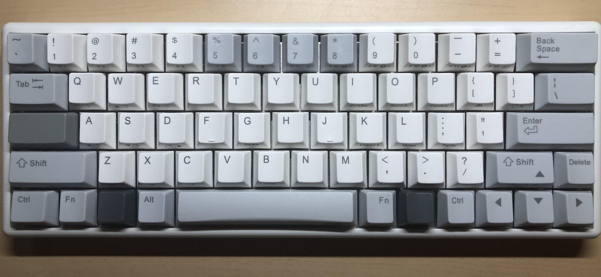
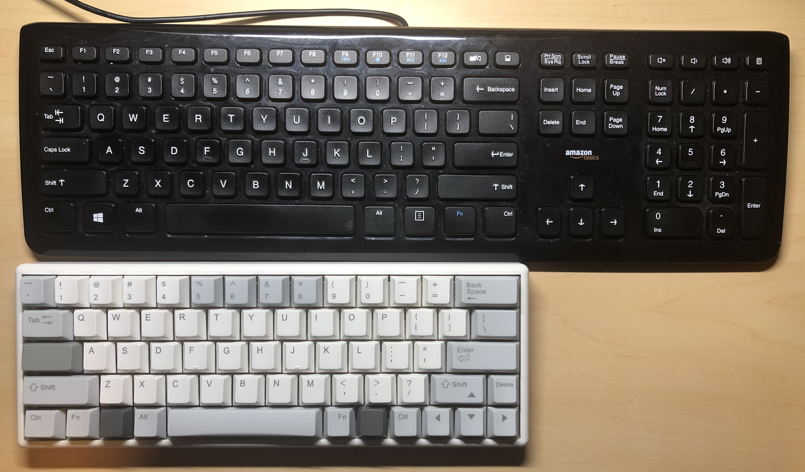

Like most people that work with a computer, I do a lot of typing in a day. Previously, I had typed with the Toyota Camry of keyboards at home, an AmazonBasics keyboard. It is boring but *does-exactly-what-it-is-for*, and your wallet thanks you for it. One day, after hours of typing during my work from home, I experienced a sensation of sharp pain traveling down my hand between the thumb and index finger. It felt like an angry crab pinching you in the palm. Not that I would know why a crab gets mad, but that's when I learned about [Carpal tunnel syndrome](https://en.wikipedia.org/wiki/Carpal_tunnel_syndrome). Biting down a (chop)stick, I searched for ways to mitigate this problem. Here is what I found:

1. **Type less** - *not an option.*

2. **Learn [Dvorak](https://en.wikipedia.org/wiki/Dvorak_keyboard_layout)** - *Turns out the QWERTY keyboard layout that us plebs use is designed to be ["anti-ergonomic"](https://www.forbes.com/sites/quora/2019/01/10/why-was-the-qwerty-keyboard-layout-invented/#5e3557e157ae). But I love my vim+tmux keybinding too much, so no.*

3. **[Surgery](https://www.hopkinsmedicine.org/health/treatment-tests-and-therapies/carpal-tunnel-release)** - *Wow, I did not know this exists, and no thank you.*

4. **Get a more ergonomic keyboard** - *Acceptable*

So what makes for a more ergonomic keyboard? And what other properties do I want in a keyboard? These are questions I did not think deeply about prior to my "Carpal trouble". For improved ergonomics, I wanted a keyboard where my wrist does not have to travel around all the time. I read up that there are a variety of ergonomically-designed keyboards (e.g. split keyboard), but they are either too expensive, take up too much space on my desk, or don't have wireless capability. So, I decided to look for a keyboard with a more compact form factor and bigger keycaps. Lastly, having typed on a mechanical keyboard (with blue switches) at work that rapidly eroded my labmates' sanity, I wanted one that is close to dead silent. This is espcially relevant now when I have to work from home with my SO. 

After some research, I ended up getting a 60% electro-capacitive keyboard with 66 keys ([NiZ Plum 66](https://www.nizkeyboard.com/products/niz-2019-new-member-atom66-the-smallest-electro-capactive-bluetooth-keyboard-with-rgb-or-non-rgb?variant=30346533961799)).

It's 60% of a standard keyboard which makes it quite compact and you can also notice the key spacing is much smaller in comparison.

My typing experience has improved dramatically as a result of the compactness, I can now easily reach keys on the keyboard or use my mouse without too much wrist movement. A month into using the new keyboard on a daily basis, I can safely say that my Carpal syndrome has completely subsided.

**But, I have some questions:**

1. **Is the electro-capacitive keyboard actually more quiet?**

2. **Does the comfort level translate into faster typing speed and higher accuracy?**

To answer the first question, I made a audio recording of typing on three different keyboards (at roughly the same distance from keyboard).

**NiZ Plum 66**
<audio
    controls
    src="./NiZ_Plum_66_typing.m4a">
        Your browser does not support the
        <code>audio</code> element.
</audio>

**AmazonBasics keyboard**
<audio
    controls
    src="./AmazonBasics_typing_cropped.m4a">
        Your browser does not support the
        <code>audio</code> element.
</audio>

**Macbook Pro 13" butterfly keyboard**
<audio
    controls
    src="./MBP_13_2017_typing_cropped.m4a">
        Your browser does not support the
        <code>audio</code> element.
</audio>

That's pretty qualitative. We can quantify amplitude of the typing sound using a bit of python magic.

<iframe id="igraph" scrolling="no" style="border:none;" seamless="seamless" src="./bootstrap_loudness.html" height="500" width="100%"></iframe>

I bootstrapped the 10 second clip to obtain an estimate of the loudness for each keyboard. It seems electro-capacitive keyboard produces typing sound that is right between the Macbook Pro butterfly keyboard, one that uses scissor mechanism and is expectedly the quietest keyboard (our positive control, so to speak), and our AmazonBasics keyboard, which uses membrane mechanism without moving components. I am quite surprised that the electro-capacitive keyboard makes even less sound than the membrane keyboard, as it does contain a few more moving parts. So yes, the NiZ Plum is notocieably quieter than a regular keyboard, and is definitely more quiet in comparison to most mechanical keyboards.

To address the second question, I conducted a [typing speed test](https://10fastfingers.com/advanced-typing-test/english) to record the average typed words per minute (WPM) and acurracy for each keyboard over 5 trials. Thanks to Sabrina Sok (SS) for volunteering as a "biological replicate". Here are the results:

<iframe id="igraph" scrolling="no" style="border:none;" seamless="seamless" src="./typing_test.html" height="500" width="100%"></iframe>

I actually typed slower on the more comfortable, electro-capacitive keyboard! Inclusion of a second subject, who probably wished that I didn't spend the money on a new keyboard even though she agrees it's the more comfortable keyboard, also shows that comfort level does not necessarily lead to better typing performance. This concurs with my experience as I noticed the smaller key spacing and very light actuation force required (45 newton) led to many accidental key presses when I had to type in rapid succession. We can also see quite clearly that when we are able to type fast, our accuracy also tends to be high. Anecdotally, I noticed that when I am typing slow, it was because I was backspacing to correct typos that I made.

<iframe id="igraph" scrolling="no" style="border:none;" seamless="seamless" src="./typing_test_correlation.html" height="500" width="100%"></iframe>

**In summary:**

**1. Smaller keyboard can be more ergonomic by cutting down wrist movement.**

**2. Electro-capacitive keyboards such as the NiZ Plum 66 are very quiet, but not as quiet as the Macbook Pro (2017 model) butterfly keyboard**

**3. Better typing comfort level does not translate into better typing performance.**

Although I may be trading in ~5-6 words per minute for using a more comfortable keyboard, my productivity is rate-limited by the speed at which I think or read (yeah I am a dummy), so this is totally acceptable. If there are typos in this post, it is definitely the keyboard's fault. I hope to get better at typing with the new keyboard over time. Maybe I will do another test in the future to measure if there is any improvement. 
